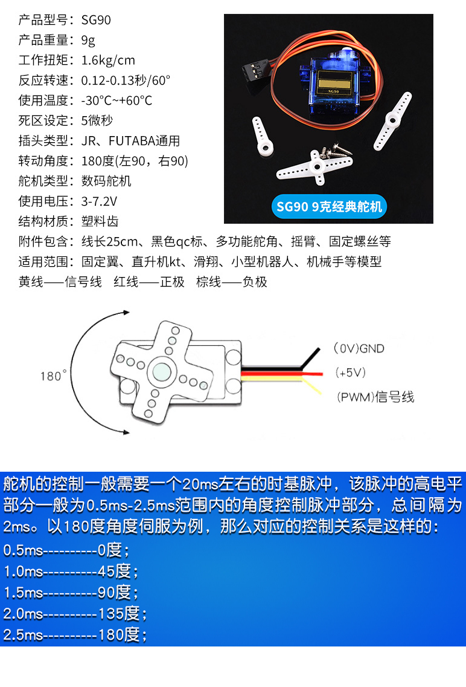

# STM32F103C8T6开发板(BluePill) BSP 说明

[[English]](README_EN.md)
[[部署教程]](deplay.md)

## 简介

本文档为 STM32F103C8T6开发板(BluePill) 的 BSP (板级支持包) 说明。

主要内容如下：

- 开发板资源介绍
- BSP 快速上手
- 进阶使用方法

通过阅读快速上手章节开发者可以快速地上手该 BSP，将 RT-Thread 运行在开发板上。在进阶使用指南章节，将会介绍更多高级功能，帮助开发者利用 RT-Thread 驱动更多板载资源。


## 开发板介绍

STM32F103C8T6开发板，采用SWD调试接口，可以用3个接口就能完成调试下载的任务，采用了官方建议的负载RTC晶振方案，小体积高频率的STM32实验板

开发板外观如下图所示：


该开发板常用 **板载资源** 如下：

- MCU：STM32F103C8T6，主频 72MHz，128KB ROM，20KB RAM
- 外部 RAM：无
- 外部 FLASH：有
- 常用外设
  - OLED屏幕
  - SG90舵机
  - 串口转USB
  - ST-LINK烧录器
  - 光敏传感
  - 有源蜂鸣器
  - 红外接收器
- 常用接口：无
- 调试接口：SWD调试接口

## 参考文档

 [Cortex-M3权威指南](documents/stm32Documents/Cortex-M3权威指南.pdf) 

 [STM32F10xxxCortex-M3编程手册](documents/stm32Documents/STM32F10xxxCortex-M3编程手册.pdf) 

 [STM32F10xxx参考手册(英文)](documents/stm32Documents/STM32F10xxx参考手册（英文）.pdf) 

 [STM32F10xxx参考手册(中文)](documents/stm32Documents/STM32F10xxx参考手册（中文）.pdf) 

 [STM32F10xxx闪存编程参考手册(英文)](documents/stm32Documents/STM32F10xxx闪存编程参考手册（英文）.pdf) 

 [STM32F10xxx闪存编程参考手册(中文)](documents/stm32Documents/STM32F10xxx闪存编程参考手册（中文）.pdf) 

 [STM32F103C8T6引脚定义](documents/stm32Documents/STM32F103C8T6引脚定义.xlsx) 

 [STM32F103x8B数据手册(英文)](documents/stm32Documents/STM32F103x8B数据手册（英文）.pdf )

 [STM32F103x8B数据手册(中文)](documents/stm32Documents/STM32F103x8B数据手册（中文）.pdf) 

 [STM32F103xx固件函数库用户手册](documents/stm32Documents/STM32F103xx固件函数库用户手册.pdf) 

## 模块资料

### FLASH

 [C97521_NOR+FLASH_W25Q128JVSIQ_规格书_WINBOND(华邦)NOR+FLASH规格书](documents/moduleDocuments/FLASH/C97521_NOR+FLASH_W25Q128JVSIQ_规格书_WINBOND(华邦)NOR+FLASH规格书.PDF) 

### SG90舵机

 [舵机的相关原理与控制原理](documents/moduleDocuments/SG90/SG90_9G/舵机的相关原理与控制原理.doc) 



### ST-LINK

 [keil5.20下ST-Link+V2设置说明-基于编程调试stm32](documents/moduleDocuments/ST-LINK/keil5.20下ST-Link+V2设置说明-基于编程调试stm32.pdf) 

### 光敏电阻传感器

 [C11302_光敏电阻_GL5626（10-15K）_规格书_JCHL(晶创和立)光敏电阻规格书](documents/moduleDocuments/Photoresistance_sensor/sensor.PDF) 

### 红外接收

 [C72048_红外遥控接收头(IRM)_IRM-56384_规格书_EVERLIGHT(亿光)红外遥控接收头规格书](documents/moduleDocuments/Infrared_reception/C72048_红外遥控接收头(IRM)_IRM-56384_规格书_EVERLIGHT(亿光)红外遥控接收头规格书.PDF) 

### 可调电阻

 [可调电阻](documents/moduleDocuments/Adjustable_resistanceAdjustable_resistanceAdjustable_resistance/可调电阻.pdf) 

### 显示屏

 [中景园电子0.96寸OLED使用文档新手必看V2.0](documents/moduleDocuments/Display/中景园电子0.96寸OLED使用文档新手必看V2.0.pdf)

### 有源蜂鸣器

 [C360615_蜂鸣器_SUN-12095-5VPA7.6_规格书_S&S(海旭)蜂鸣器规格书](documents/moduleDocuments/Active_buzzer/C360615_蜂鸣器_SUN-12095-5VPA7.6_规格书_S&S(海旭)蜂鸣器规格书.PDF) 
## 具体详细资料包含标准库
* ***通过网盘分享的文件：学习板资料.zip
链接: https://pan.baidu.com/s/1j8Zw8828-aEr8VPJzYhy1Q?pwd=tkv6 提取码: tkv6 
--来自百度网盘超级会员v3的分享***
## 外设支持

本 BSP 目前对外设的支持情况如下：

| **板载外设**      | **支持情况** | **备注**                              |
| :----------------- | :----------- | :------------------------------------- |
| 	红色LED1		 |     支持      |       PA1                     |
| 红色LED2	| 支持 | PA2 |
| 红色LED3	| 支持 | PA3 |
| 红色LED4	| 支持 | PA4 |
| 红色LED5	| 支持 |  |
| PWM舵机	| 支持 | PA0 |
| FLASH存储	| 支持 | SPI1  PA5/PA6/PB10/PB11 |
| OLED屏幕	| 支持 | SDA(PB9)/SDL(PB8) |
| 有源蜂鸣器	| 支持 | PB12 |
| 光敏传感	| 支持 | PB13 |
| 串口转USB	| 支持 | CH340N  PA9/PA10 |
| 红外接收装置	| 支持 | PB0 |
| 按键3	| 支持 | PB1 |
| 按键4	| 支持 | PB15 |
| **片上外设**      | **支持情况** | **备注**                              |
| GPIO              | 支持 | GPIOA-GPIOE |
| ADC | 支持 | ADC1 |
| SPI | 支持 | SPI2 |
| I2C | 支持 | I2C1  SCL(PB8)/SDA(PB9) |
| UART | 支持 | UART1/UART2/UART3 |
| RTC | 支持 |  |
| PWM | 支持 | PWM2(channel1)/PWM3(channel1,channel2,channel3,channel4) |
| USB Divice | 支持 | |
| UDID | 支持 | |


## 使用说明

使用说明分为如下两个章节：

- 快速上手

    本章节是为刚接触 RT-Thread 的新手准备的使用说明，遵循简单的步骤即可将 RT-Thread 操作系统运行在该开发板上，看到实验效果 。

- 进阶使用

    本章节是为需要在 RT-Thread 操作系统上使用更多开发板资源的开发者准备的。通过使用 ENV 工具对 BSP 进行配置，可以开启更多板载资源，实现更多高级功能。


### 快速上手

本 BSP 为开发者提供 MDK4、MDK5 和 IAR 工程，并且支持 GCC 开发环境。下面以 MDK5 开发环境为例，介绍如何将系统运行起来。

#### 硬件连接

使用数据线连接开发板到 PC，打开电源开关。

#### 编译下载

双击 project.uvprojx 文件，打开 MDK5 工程，编译并下载程序到开发板。

> 工程默认配置使用 J-Link 仿真器下载程序，在通过 J-Link 连接开发板的基础上，点击下载按钮即可下载程序到开发板

#### 运行结果

下载程序成功之后，系统会自动运行，LED 闪烁

连接开发板对应串口到 PC , 在终端工具里打开相应的串口（115200-8-1-N），复位设备后，可以看到 RT-Thread 的输出信息:

```bash
 \ | /
- RT -     Thread Operating System
 / | \     4.0.1 build Mar 10 2019
 2006 - 2019 Copyright by rt-thread team
msh >
```
### 进阶使用

此 BSP 默认只开启了 GPIO 和 串口1 的功能，如果需使用 ADC、SPI等更多高级功能，再用 ENV 工具对BSP 进行配置，步骤如下：

1. 在 bsp 下打开 env 工具。

2. 输入`menuconfig`命令配置工程，配置好之后保存退出。

3. 输入`pkgs --update`命令更新软件包。

4. 输入`scons --target=mdk4/mdk5/iar` 命令重新生成工程。

本章节更多详细的介绍请参考 [STM32 系列 BSP 外设驱动使用教程](../docs/STM32系列BSP外设驱动使用教程.md)。


## 注意事项

- 只能用USB转TTL连接PC机 ;


## 感谢 & 维护

- 感谢[obito0](https://github.com/obito0)提供的[原始工程](../stm32f103-mini-system)
- [Meco Man](https://github.com/mysterywolf): jiantingman@foxmail.com
