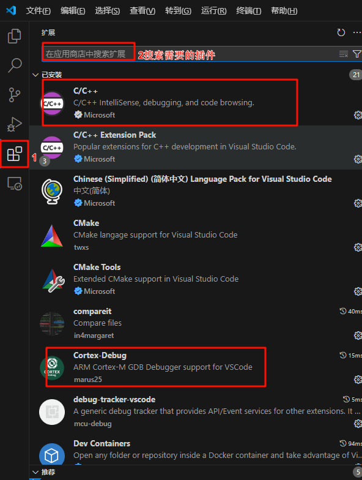
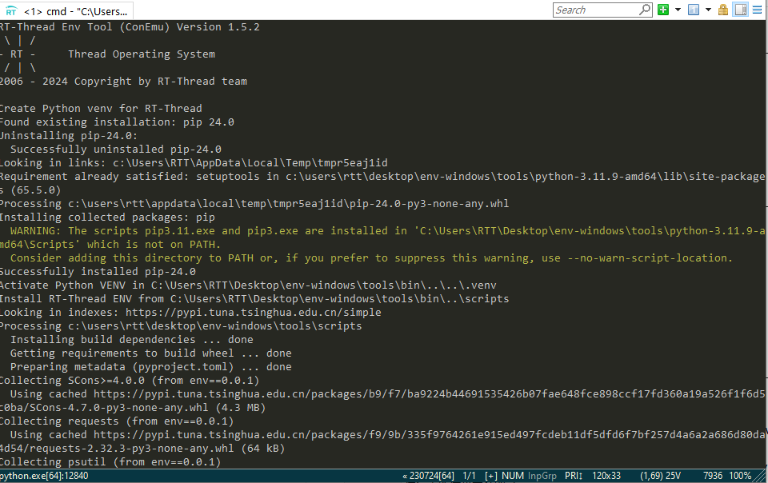
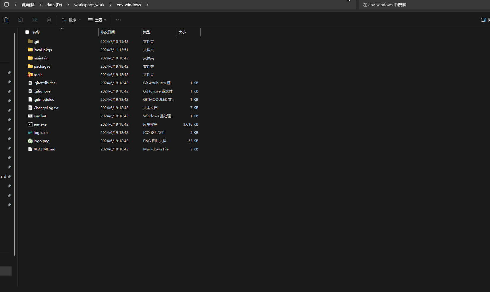
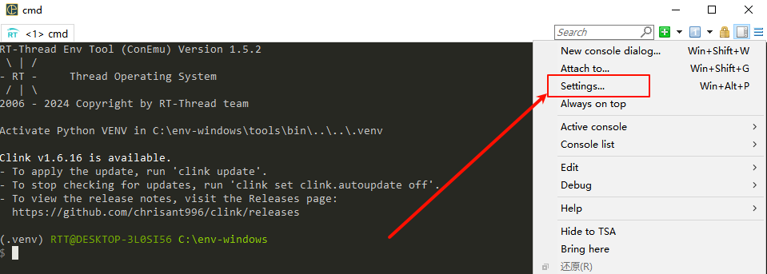
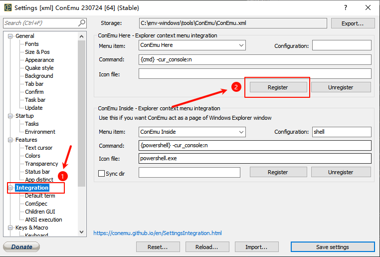
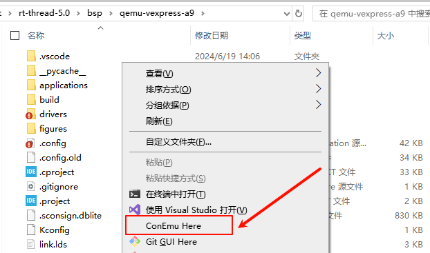
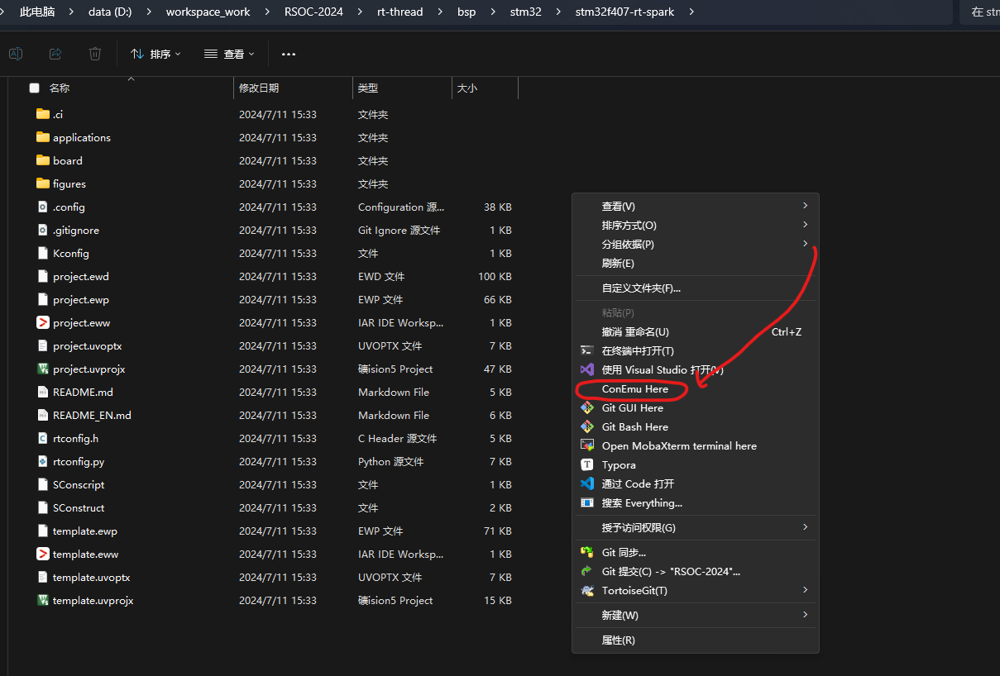
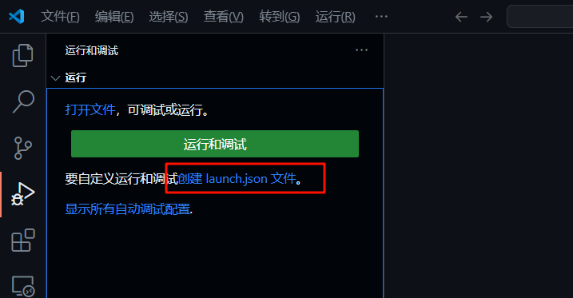
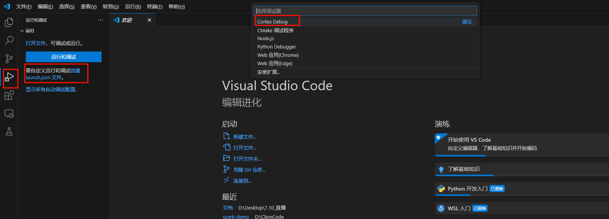
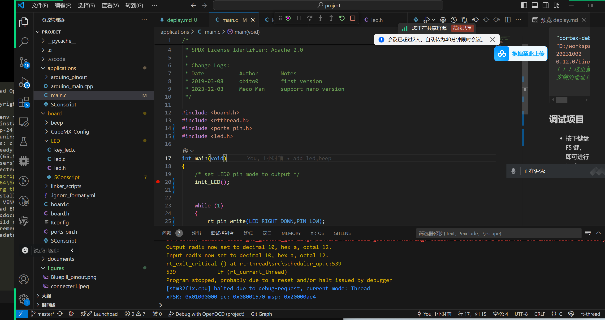

# HPUStudioBoard + VSCode + Env 环境搭建

## 安装VSCode及插件

本文准备资料如下：
    1.RT-Thread 源码  
    2.Env工具  
    3.OpenOCD工具
    4.VSCode编辑器
* 在 VSCode Extensions 里下载并安装支持 C/C++ 的调试插件：



## 安装Env工具

### 下载链接

[[下载地址]](https://download-redirect.rt-thread.org/download/env_release/env-windows-v2.0.0.7z)

下载并解压 env-windows-v2.0.0.7z 到系统任意目录，双击 env.exe 进入 env 环境，进行首次使用环境初始化。  

### 注意事项

首次使用需要联网安装pip依赖，请等待依赖安装完成，若安装失败：请手动删除 env-windows 目录下的.venv 目录，再次打开 env.exe 进行重新依赖安装即可。

* 初次使用会初始化环境如下图：





### 注册环境变量

* 安装下图进入设置界面


* 点击注册到环境变量按钮，然后退出



* 至此可以在任意目录下进行打开env了



## 编程工作

* 在工程文件下打开env



* 输入 scons --target=vsc 命令，生成VSCode工程:
* 使用VSCode打开工程。
* 在env 中输入 scons -j12 来编译工程

## VSCode 下载调试配置

* 首先创建 launch.json 文件



* 选择 Cortex Debug 选项



* 然后在launch.json 文件中添加如下代码：

```json
{
    "version": "0.2.0",
    "configurations": [
        {
            "name": "rt-spark-openocd",
            "executable": "${workspaceRoot}/rt-thread.elf",
            "request": "launch",
            "type": "cortex-debug",
            "runToEntryPoint": "main",
            "targetId": "STM32F407ZG",
            "servertype": "openocd",
            "configFiles": [
                "interface/stlink-v2.cfg",
                "target/stm32f1x.cfg"
            ],
            "armToolchainPath": "D:/workspace_work/env-windows/tools/gnu_gcc/arm_gcc/mingw/bin", // ！！！需要修改为自己的GCC 工具链路径 ！！！
            "gdbPath": "D:/workspace_work/env-windows/tools/gnu_gcc/arm_gcc/mingw/bin/arm-none-eabi-gdb.exe" // ！！！需要修改为自己的GDB 路径 ！！！
        }
    ]
}

```

* 在 settings.json 最后字段追加 openocd 的路径
* [[openocd 下载地址]](https://gnutoolchains.com/arm-eabi/openocd/)


```json
"cortex-debug.openocdPath": "D:/workspace_work/OpenOCD-20231002-0.12.0/bin/openocd.exe" // ！！！这里替换成自己openocd安装的地址！！！

```

## 调试项目
* 按下键盘 F5 键，即可进行调试。



* 可以按下F5全速运行，开发板的LED灯就会开始闪烁了


